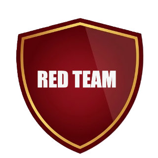
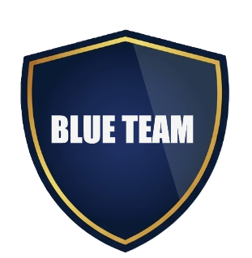

<h1 align="center">Hi, I'm Ángel Castaño 👋</h1>
 

😁 I'm a Network and Systems Administration (ASIR) graduate passionate about
IT infrastructure, networking, and cybersecurity.
I hold Cisco CCNA (1, 2, and 3), Ethical Hacker, Network Security, and
Linux Essentials certifications. I have hands-on experience providing IT
support at Accenture in hospitals and healthcare centers across Madrid,
working with Windows environments, Active Directory, TCP/IP, VPNs, Cisco
devices, and ITIL-based incident management.
I'm currently expanding my skills in Cybersecurity and AWS technologies while pursuing opportunities in
System Administration, Networking, and Cybersecurity.

 

  
  
  

### 👨‍💻 About Me

📒 Currently improving my skills in Cloud and Cybersecurity.

🌐 Cisco CCNA (1, 2 & 3), Ethical Hacker, Network Security & Linux Essentials certified.

💼 Hands-on IT Support experience at Accenture in healthcare environments.

⌨️ Learning Python and Bash for automation.

🎯 Goal: Build a career as a System & Network Administrator / Cybersecurity Engineer.

 

### 🧲 Connect Me

  

  

 

### 📊 GitHub Stats

 

<h3 align="center">📚 Languages, Technologies & Tools I Have Placed My Hands On</h3> 

   
   
  

  

    
    
    
    
    
    
    
    
  

### 🚀 Proyectos

#### 🛡️ SentinelLab — Mini-SOC de Detección y Respuesta
`Wazuh` `Suricata` `Snort` `YARA` `Sigma` `SIEM` `Threat Intelligence` `OpenVAS` `DefectDojo`
Laboratorio casero de ciberseguridad que recorre el ciclo completo de un SOC: centralización de logs, detección en red y endpoint, correlación de eventos en SIEM, threat intelligence y gestión de vulnerabilidades.

#### 📡 TechSolutions AI — TFG: Monitorización de Red y Servidores
`Linux` `Bash` `Wazuh` `Grafana` `Windows Server` `Active Directory` `PostgreSQL` `Crontab`
Infraestructura corporativa virtualizada orientada a la seguridad informática, la monitorización de eventos en tiempo real y la automatización de tareas.

#### 🌐 Plataforma Web de Oposiciones
`HTML` `CSS` `JavaScript`
Plataforma de estudio offline-first con temario íntegro y tests interactivos para oposiciones de la Comunidad de Madrid.

#### 🏋🏻 GymTrack - App privada de seguimiento de gimnasio
`HTML` `CSS` `JavaScript`
App web privada (PWA) para seguimiento de gimnasio: entrenos, drop sets, rutinas, calendario, medidas y gráficas. Tus datos nunca salen de tu dispositivo.

### 🎓 Certificaciones

| Certificación | Entidad | Año |
|---|---|---|
| CCNA - 1: Introduction to networks | Cisco | 2026 |
| CCNA - 2: Switching, Routing & Wireless | Cisco | 2026 |
| CCNA - 3: Business Networks, Security and Automation | Cisco | 2026 |
| Network Security | Cisco | 2026 |
| Linux Essentials | Cisco | 2026 |
| Ethical Hacker | Cisco | 2026 |
| MySQL Database Administration | Oracle | 2025 |
| Database Design & Programming | Oracle | 2025 |

